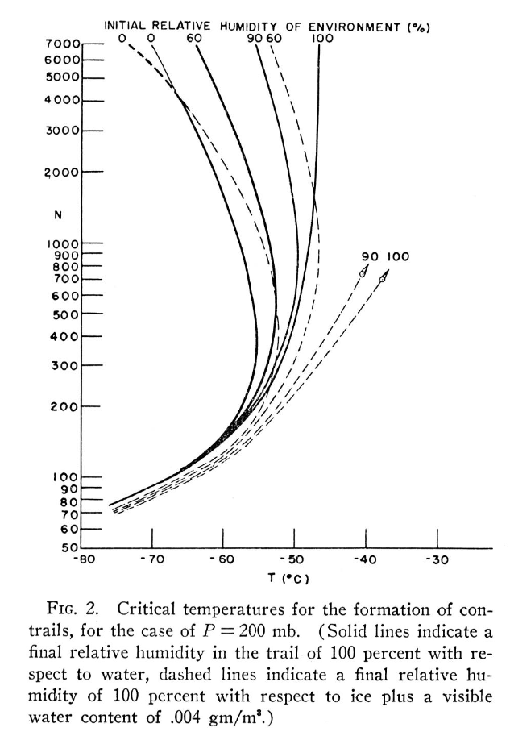

A complete set of such graphs was
constructed for each 100-mb level from 1,000 to
100 mb, for relative humidities with respect to
water of 0, 60, 90, and 100 percent, for tempera-
tures down to — 80° C, and ratios of entrained
environment to exhaust gas from 58: 1 to 7,000: 1.
FIGURES 2 and 3 show the composite graphs for
the 200-mb level.

https://iitbacin-my.sharepoint.com/:o:/g/personal/23b1244_iitb_ac_in/EZzVXP1ilT9LpL4dGXAKPicB4ibof3uuPUtgyWYwl8oZsw?rtime=CyZNFeDq3Eg

https://acp.copernicus.org/articles/17/403/2017/

https://gmd.copernicus.org/articles/5/543/2012/gmd-5-543-2012.pdf